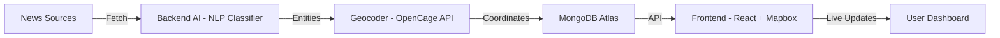

# 🛰️ Sentinel OS  
**AI-Powered Global Threat Monitoring System**

---

## 🌍 Overview  
**Sentinel OS** is a **real-time intelligence platform** that monitors global instability by analyzing live news feeds, detecting threats using AI, and projecting them onto a **3D interactive globe**.  
It provides situational awareness through data-driven insights, making it useful for researchers, analysts, and developers working on crisis monitoring and security visualization.

---

## ✨ Features  
- 🌐 **3D Globe Visualization** – Interactive threat mapping with Mapbox GL JS.  
- 🤖 **AI Threat Detection** – NLP models classify incidents as potential threats.  
- 📍 **Geolocation Mapping** – Converts extracted entities into coordinates (OpenCage API).  
- 📊 **Live Feed Panel** – Real-time list of threats with categories and timestamps.  
- 🔍 **Filtering & Sorting** *(coming soon)* – Refine by region, type, and severity.  
- 🛠 **Admin Dashboard** *(coming soon)* – Verify, update, or dismiss detected threats.  
- 🔔 **Critical Alerts** *(coming soon)* – Audio notifications for high-priority events.  

---

## 🏗️ System Architecture  

---
## 🛠️ Tech Stack

### **Frontend**
- ⚛️ React.js  
- 🎨 TailwindCSS  
- 🎥 Framer Motion  
- 🌍 Mapbox GL  

### **Backend**
- 🟢 Node.js  
- 🚂 Express.js  
- 🍃 MongoDB Atlas  
- 🤖 OpenAI API  
- 📍 OpenCage API  

---

## 🚀 Getting Started

### 1. Clone the repository
```
git clone https://github.com/Haschwalt29/Sentinel-OS.git
cd Sentinel-OS
```

## 🛠️ Backend Setup

```
cd backend
npm install
```
Create a .env file inside /backend with the following:
```
MONGODB_URI=your_mongo_uri
OPENCAGE_API_KEY=your_opencage_api_key
OPENAI_API_KEY=your_openai_api_key
```
Start the backend:
```
npm run start
```
---
## 🎨 Frontend Setup
```
cd ../frontend
npm install
npm start
```
## 🌐 Deployment

Frontend → Vercel / Netlify

Backend → Render / Railway

(See DEPLOYMENT.md for detailed deployment steps.)

## 📸 Demo (Preview)


## 🤝 Contributing

Pull requests are welcome!
If you’d like to collaborate, check the Issues tab or start a Discussion.

## 📩 Contact

Author: Aditya Rane
🔗 LinkedIn: https://www.linkedin.com/in/aditya-rane-9b82822aa/


